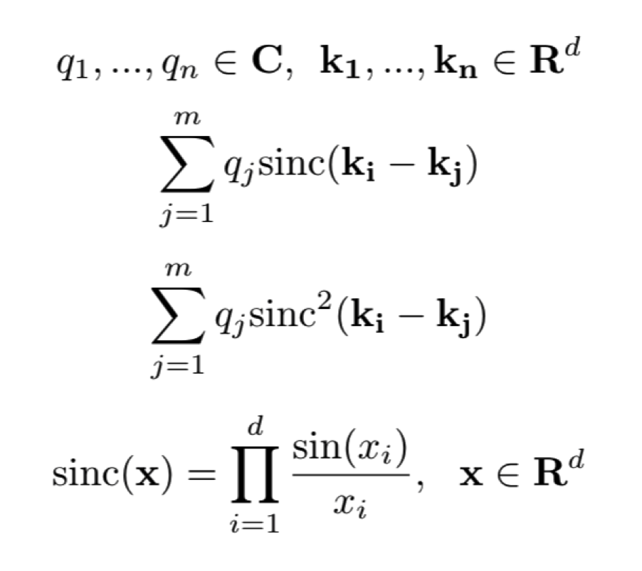

# Sinc Transform

A C++ package for computing the fast sinc and sinc-squared transforms in 1, 2, and 3 dimensions according to the algorithm proposed by Greengard et. al. in 2006. Matlab codes are included for convenience as well. The transforms are defined as follows: 

## Documentation
Please see the primary documentation [here](http://fast-sinc-transform.readthedocs.io/en/latest/) for installation instructions, example code, derivations, licenses, etc. 

## Prerequisites
Note that this code crucially requires the [FINUFFT](https://github.com/ahbarnett/finufft) library, as detailed in the installation instructions, as well as all of its required libraries (FFTW, for example). 
