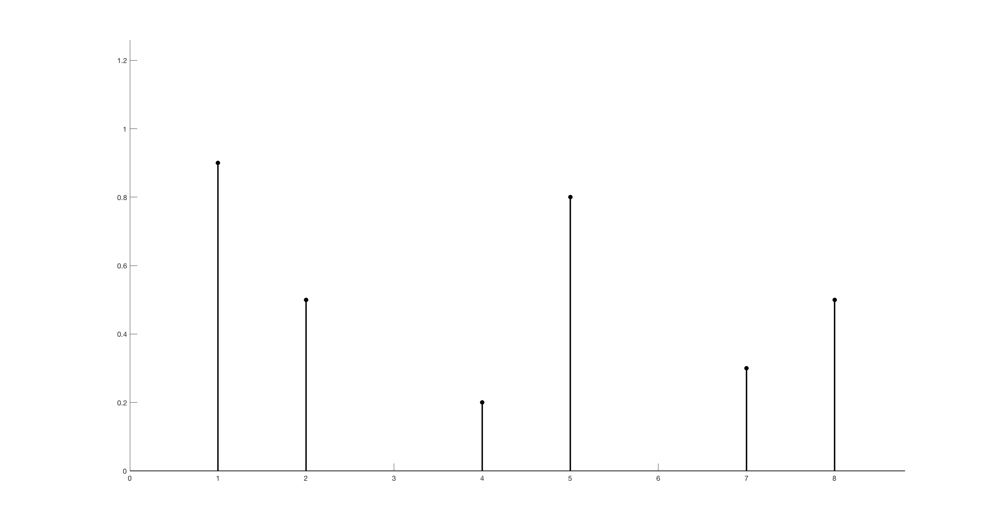
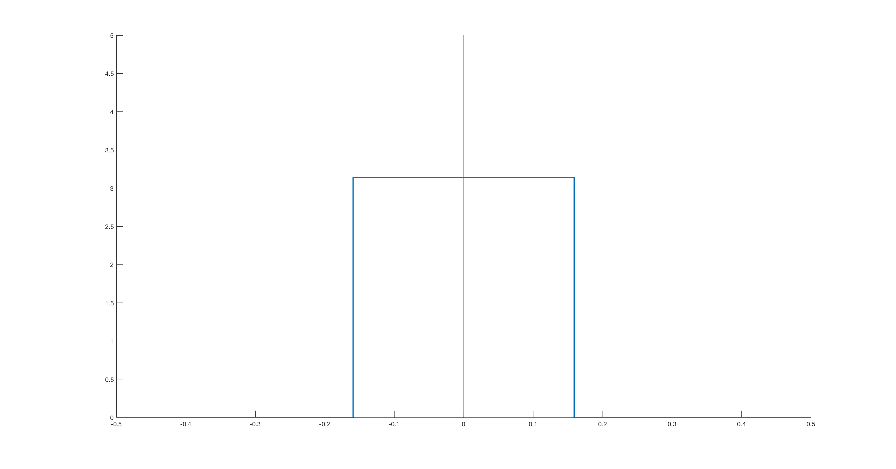
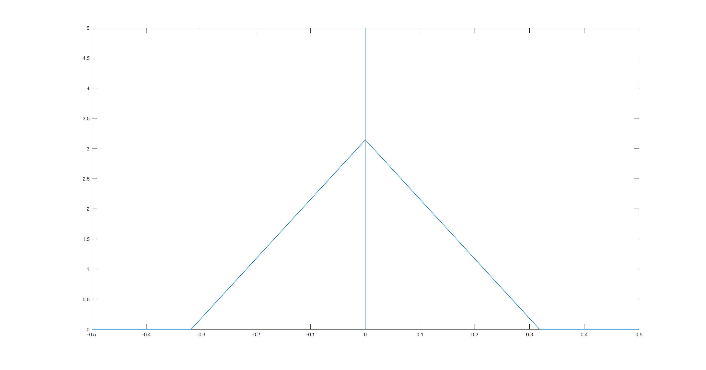

Mathematical Derivation
=========================================

Recall the objective is to compute 

.. math::

	\sum_{j=1}^m q_j\text{sinc}(\mathbf{k_i}-\mathbf{k_j})

	\sum_{j=1}^m q_j\text{sinc}^2(\mathbf{k_i}-\mathbf{k_j})

Also, the finufft library can quickly compute expressions of the form

.. math::

	\sum_{j=1}^m f(x_j)e^{\pm i x_j k_r}

where the points :math:`x_j` and :math:`k_r` may be arbitrarily spaced.

Conventions
-------------

..  math::

	\mathcal{F}(h(\mathbf{x}))(\mathbf{f})=\int_{-\infty}^{\infty}h(\mathbf{x})e^{-2\pi i\mathbf{x}\mathbf{f}}dx

	\mathcal{F}^{-1}(H(\mathbf{f}))(\mathbf{x})=\int_{-\infty}^{\infty}H(\mathbf{f})e^{2\pi i\mathbf{x}\mathbf{f}}df

	\text{sinc}(x)=\frac{\sin(x)}{x}

	\text{sinc}(\mathbf{x})=\text{sinc}(x_1)\text{sinc}(x_2)\text{sinc}(x_3)

Note that sometimes :math:`\text{sinc}(x)` is defined as :math:`\frac{\sin(\pi x)}{\pi x}`. The derivation below is the same, with some minor alterations to constants. This option is included in the code, as the ifl flag.

Use of Convolution
--------------------

Define

.. math::

	f(\mathbf{k})=\sum_{j=1}^{m}\delta(\mathbf{k}-\mathbf{k_j})q_j

    One example of :math:`f`, where the y-axis measures area

.. math::

	\mathcal{F}(f(\mathbf{k}))=\int_{-\infty}^{\infty}\sum_{j=1}^{m}\delta(\mathbf{k}-\mathbf{k_j})q_je^{-2\pi i\mathbf{k}\mathbf{x}}d\mathbf{k}=\sum_{j=1}^{m}q_je^{-2\pi i\mathbf{k_j}\mathbf{x}}

Then

.. math::

	(\text{sinc} \ast f)(\mathbf{k_i})=\int_{-\infty}^{\infty}\text{sinc}(\mathbf{k_i}-\mathbf{k})f(\mathbf{k})d\mathbf{k}

	=\sum_{j=1}^{m}q_j\int_{-\infty}^{\infty}\text{sinc}(\mathbf{k_i}-\mathbf{k})\delta(\mathbf{k}-\mathbf{k_j})d\mathbf{k}

	=\sum_{j=1}^m q_j\text{sinc}(\mathbf{k_i}-\mathbf{k_j})

Similarly

.. math::

	(\text{sinc}^2 \ast f)(\mathbf{k_i})=\int_{-\infty}^{\infty}\text{sinc}^2(\mathbf{k_i}-\mathbf{k})f(\mathbf{k})d\mathbf{k}

	=\sum_{j=1}^{m}q_j\int_{-\infty}^{\infty}\text{sinc}^2(\mathbf{k_i}-\mathbf{k})\delta(\mathbf{k}-\mathbf{k_j})d\mathbf{k}

	=\sum_{j=1}^mq_j\text{sinc}^2(\mathbf{k_i}-\mathbf{k_j})

So, the desired quantities are :math:`(\text{sinc} \ast f)(\mathbf{k_i})` and :math:`(\text{sinc}^2 \ast f)(\mathbf{k_i})`. But by the convolution theorem:

.. math::

	(\text{sinc} \ast f)(\mathbf{k_i})=\mathcal{F}^{-1}(\mathcal{F}(\text{sinc})\mathcal{F}(f))(\mathbf{k_i})

	(\text{sinc}^2 \ast f)(\mathbf{k_i})=\mathcal{F}^{-1}(\mathcal{F}(\text{sinc}^2)\mathcal{F}(f))(\mathbf{k_i})
	
Luckily, :math:`\mathcal{F}(\text{sinc})` and :math:`\mathcal{F}(\text{sinc}^2)` take simple forms, which are derived below.

Fourier Transform of :math:`\text{Sinc}`
-------------------------------------------

1D
~~~~~
Consider the function

.. math::

	h(x)= \: b \: \: \: \: |x|\leq a 

	0 \: \: \: \: |x|>a 

We have that

.. math::

	\mathcal{F}(h(x))(f)=\int_{-a}^{a}be^{-2\pi ixf}dx=2ab\text{sinc}(2\pi af)

Using the symmetry of Fourier transform, i.e. :math:`\mathcal{F}(h(x))(f)=h(-f)`, and that :math:`h(x)` is even:

.. math::

	\mathcal{F}(H(x))(f)=\mathcal{F}(2ab\text{sinc}(2\pi ax))(f)=h(x)

Then :math:`h(x)` with :math:`a=\frac{1}{2\pi}` and :math:`b=\pi` is equal to :math:`\mathcal{F}(\text{sinc}(x))(f)`, as shown below.

    The Fourier transform of sinc in 1D.

2D
~~~~~
Again, let 

.. math::

	h(x)= \: b \: \: \: \: x_1\leq a , \: x_2 \leq a

	0 \: \: \: \: x_1 > a , \: x_2 > a

.. math::
	
	\mathcal{F}(h(\mathbf{x}))(\mathbf{f})=\int_{-a}^{a}\int_{-a}^{a}be^{-2\pi i\mathbf{x}\mathbf{f}}d\mathbf{x}=4a^2b\text{sinc}(2\pi af_1)\text{sinc}(2\pi af_2)=4a^2b\text{sinc}(2\pi a\mathbf{f})

As before, setting :math:`a=\frac{1}{2\pi}` and :math:`b=\pi^2` yields :math:`\mathcal{F}(\text{sinc}(\mathbf{x}))(f)`

3D
~~~~

Let 

.. math::

	h(x)= \: b \: \: \: \: x_1\leq a , \: x_2 \leq a, \: x_3 \leq a

	0 \: \: \: \: x_1 > a , \: x_2 > a, \: x_3 > a

.. math::
	
	\mathcal{F}(h(\mathbf{x}))(\mathbf{f})=\int_{-a}^{a}\int_{-a}^{a}\int_{-a}^{a}be^{-2\pi i\mathbf{x}\mathbf{f}}d\mathbf{x}=8a^3b\text{sinc}(2\pi af_1)\text{sinc}(2\pi af_2)\text{sinc}(2\pi af_3)=8a^3b\text{sinc}(2\pi a\mathbf{f})

Setting :math:`a=\frac{1}{2\pi}` and :math:`b=\pi^3` yields :math:`\mathcal{F}(\text{sinc}(\mathbf{x}))(f)`

Fourier Transform of :math:`\text{Sinc}^2`
---------------------------------------------

The following basic fact about convolution, combined with the previous section, will easily provide the Fourier transform of :math:`\text{sinc}^2`

.. math::

	\mathcal{F}(\text{sinc}^2(\mathbf{x}))(\mathbf{f})=(\mathcal{F}(\text{sinc}(\mathbf{x})) \ast \mathcal{F}(\text{sinc}(\mathbf{x})))(\mathbf{f})

1D
~~~~~

.. math::

	\mathcal{F}(\text{sinc}^2(\mathbf{x}))(\mathbf{f})= \pi(1-\pi|x|) \: \: \: \: |x|\leq \frac{1}{\pi}

	0 \: \: \: \: |x| > \frac{1}{\pi}

    The Fourier transform of sinc-squared in 1D.

2D
~~~~~

.. math::

	\mathcal{F}(\text{sinc}^2(\mathbf{x}))(\mathbf{f})= \pi^2(1-\pi|x_1|)(1-\pi|x_2|) \: \: \: \: |x_1|\leq \frac{1}{\pi}, \:|x_2|\leq \frac{1}{\pi}

	0 \: \: \: \: |x_1| > \frac{1}{\pi}, \:|x_2| > \frac{1}{\pi}

3D
~~~~~

.. math::

	\mathcal{F}(\text{sinc}^2(\mathbf{x}))(\mathbf{f})= \pi^2(1-\pi|x_1|)(1-\pi|x_2|)(1-\pi|x_3|) \: \: \: \: |x_1|\leq \frac{1}{\pi}, \:|x_2|\leq \frac{1}{\pi}, \:|x_3|\leq \frac{1}{\pi}

	0 \: \: \: \: |x_1| > \frac{1}{\pi}, \: |x_2| > \frac{1}{\pi}, \: |x_3| > \frac{1}{\pi}

Implementation
---------------
Putting together the previous sections:

.. math::

	(\text{sinc} \ast f)(\mathbf{k_i})=\mathcal{F}^{-1}(\mathcal{F}(\text{sinc})\mathcal{F}(f))(\mathbf{k_i})

	= \int_{\frac{-1}{2\pi}}^{\frac{1}{2\pi}}\pi\Big(\sum_{j=1}^{m}q_je^{-2\pi ik_jx}\Big)e^{2\pi ixk_i}dx

	= \frac{1}{2}\int_{-1}^{1}\Big(\sum_{j=1}^{m}q_je^{-ik_jy}\Big)e^{iyk_i}dy

In 2 and 3 dimensions, the constant :math:`\frac{1}{2}` changes to :math:`\frac{1}{4}` and :math:`\frac{1}{8}`, respectively, and integration is multidimensional with the same bounds.

.. math::
	
	(\text{sinc}^2 \ast f)(\mathbf{k_i})=\mathcal{F}^{-1}(\mathcal{F}(\text{sinc}^2)\mathcal{F}(f))(\mathbf{k_i})

	=\int_{\frac{-1}{\pi}}^{\frac{1}{\pi}}\pi(1-\pi|x|)\Big(\sum_{j=1}^{m}q_je^{-2\pi ik_jx}\Big)e^{2\pi ixk_i}dx

	=\frac{1}{4}\int_{-2}^{2}(2-|y|)\Big(\sum_{j=1}^{m}q_je^{-ik_jy}\Big)e^{iyk_i}dy

Again, in 2 and 3 dimensions, the constant :math:`\frac{1}{4}` changes to :math:`\frac{1}{8}` and :math:`\frac{1}{16}`, respectively, and integration is multidimensional.

In each case, there are two main tasks: computing the inner summation, and computing the outer (possibly multidimensional) integral. But the inner summation is exactly a discrete (nonuniform) Fourier transform, and is computed with the finufft library. The outer integral again takes the form of of a Fourier transform (in the other direction), but since we want the exact integral, Legendre-Gauss quadrature weights are used to weight the integrand before again applying the finufft library. Note that in the case of :math:`\text{sinc}^2`, the integrand is only piecewise continuous, so the quadrature points are treated accordingly.

