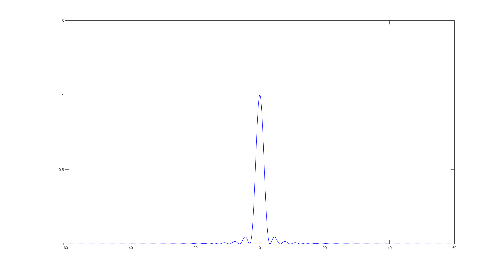

Overview
=========================================

This is a C++ package to compute the sinc and sinc-squared transforms, defined as follows with respect to some input :math:`k_1,...,k_n \in \mathds{R}` and :math:`q_1,...,q_n \in \mathds{C}`:

.. math:

	\sum_{j=1}^m}q_j\text{sinc}(\bm{k_i}-\bm{k_j})

	\sum_{j=1}^m}q_j\text{sinc}^2(\bm{k_i}-\bm{k_j})

where we define

.. math:
	
	\text{sinc}(\mathbf{x})=\prod_{i=1}^r \frac{\text{sin}(x_i)}{x_i} \: \: \: \mathbf{x} \in \mathds{R}^r

Format these so that they're next to each other

.. figure:: SincGraphBasic.png
    :width: 70%
    :align: center

    The sinc function in 1D

    The sinc function in 2d