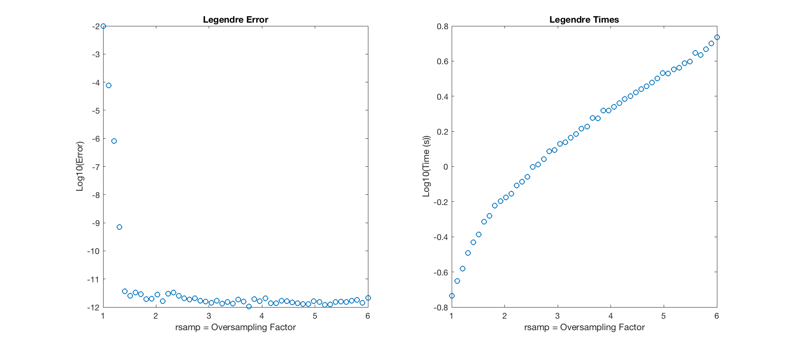

..  _Quadrature:
Quadrature
=========================================

There are two built-in quadrature options when approximating the final integral (see :ref:`Derivation` page): Gauss-Legendre [2], and corrected trapezoidal quadrature [3]. The choice is specified by the "quad" input parameter to each functon. The corrected trapezoidal rule is faster, particularly for inputs requiring many quadrature points (i.e. with high-valued :math:`k_i` or :math:`a_i`) with high requested precision, and is thus recommended.

Comparison of Methods
-----------------------
The accuracy and computation of the two quadrature methods is dependent on many factors, including :math:`N` and the number of quadrature points (affected by the maximum excursion of :math:`k_i` and :math:`a_i`). This is one example of 3D sinc in which there are many quadrature points, and so the trapezoidal quadrature has a significant advantage.

    Oversampling parameter and number of corrections for corrected trapezoidal quadrature. max :math:`|k_i|=50`

Gauss-Legendre
-----------------

The default upsampling parameter for the number of quadrature points, :math:`rsamp`, is set to 2. This can be modified directly within the functions as required. The effect of this parameter on the precision accuracy, and computation time, is shown below. Unsurprisingly, a higher upsampling parameter can at first improve accuracy somewhat, but eventually flatlines. It consistently increases computation time.

    Effect of oversampling parameter for Gauss-Legendre quadrature, 1D sinc. max :math:`a_i \leq 1000 \pi`

    Effect of oversampling parameter for Gauss-Legendre quadrature, 2D sinc. max :math:`a_i \leq 50 \pi`

    Effect of oversampling parameter for Gauss-Legendre quadrature, 3D sinc. max :math:`a_i \leq 20 \pi`

Modified Trapezoidal
------------------------

The default upsampling parameter for the number of regular trapezoidal quadrature points, :math:`rsamp`, is set to 3, based on the empirical results below. There is an additional parameter corresponding to the number of correction terms, :math:`e`. The constants are included for :math:`e` between 1 and 60, which thus restricts the allowable values of :math:`e`. By default, it is set to 25, based again on the tests below. This can be modified directly within the functions as required. The interplay between these two parameters is shown below. Once again, higher values for both parameters can improve accuracy to a certain degree. The computation time is dominated by the nonuniform Fourier transforms. In this example, computation time increases with rsamp but is largely independent of :math:`e` when there are many quadrature points. With fewer quadrature points, there is greater dependence on :math:`e`

    Effect of oversampling parameter and number of corrections for corrected trapezoidal quadrature, 1D sinc. max :math:`a_i \leq 1000 \pi`

    Effect of oversampling parameter and number of corrections for corrected trapezoidal quadrature, 2D sinc. max :math:`a_i \leq 50 \pi`

    Effect of oversampling parameter and number of corrections for corrected trapezoidal quadrature, 3D sinc. max :math:`a_i \leq 20 \pi`
